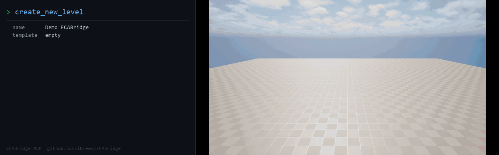

# ECABridge — AI-Powered Unreal Engine 5 MCP Plugin



**500+ MCP tools** for UE5 editor automation via Claude, ChatGPT, or any MCP-compatible AI agent. **One branch supports UE 5.7 and UE 5.8** via engine-version guards, with an embedded Python sandbox for server-side multi-tool chaining and inline base64 PNG screenshots.

> **Using this with an AI agent?** Pair it with **[ue5-mcp](https://github.com/ibrews/ue5-mcp)** — a Claude Code / Cowork skill that loads the hard-won knowledge your agent needs to use these tools without crashing the editor or wasting hours on silent-fail APIs. ECABridge is the plugin (what tools exist); ue5-mcp is the field manual (which calls actually work, which crash, and the workarounds). Install both.

## Documentation

The full docs live in the **[ECABridge Wiki](https://github.com/ibrews/ECABridge/wiki)**. Start there for:

| | |
|---|---|
| [Installation](https://github.com/ibrews/ECABridge/wiki/Installation) | Drop-in setup, Claude / Cursor config, curl smoke check |
| [Command Categories](https://github.com/ibrews/ECABridge/wiki/Command-Categories) | All ~500 tools broken down by area |
| [Recipes](https://github.com/ibrews/ECABridge/wiki/Recipes) | Concrete prompts and call sequences |
| [Rosetta Stone](https://github.com/ibrews/ECABridge/wiki/Rosetta-Stone) | The `dump_*` family — full JSON serialization of any UE5 asset |
| [MetaHuman Pipeline](https://github.com/ibrews/ECABridge/wiki/MetaHuman-Pipeline) | 22 commands for procedural MetaHuman creation, photo→character |
| [Engine Compatibility](https://github.com/ibrews/ECABridge/wiki/Engine-Compatibility) | UE 5.7 + 5.8 from one branch, deprecation backlog |
| [Coexistence with Epic's Native MCP](https://github.com/ibrews/ECABridge/wiki/Coexistence-with-Epic-MCP) | Running alongside the UE 5.8 `ModelContextProtocol` plugin, EDA panel |
| [Optional Dependencies](https://github.com/ibrews/ECABridge/wiki/Optional-Dependencies) | Structurally optional Mutable / MRQ / MetaHuman / Niagara / MetaSound / ControlRig / GAS |
| [Python Sandbox](https://github.com/ibrews/ECABridge/wiki/Python-Sandbox) | `execute_script` for multi-tool chaining in one MCP round trip |
| [What's New](https://github.com/ibrews/ECABridge/wiki/Whats-New) | Recent changes |

## Quick start

1. Copy the plugin folder to your project's `Plugins/` directory.
2. Add to your `.uproject`:
   ```json
   {"Name": "ECABridge", "Enabled": true}
   ```
3. Build and launch the editor — ECABridge starts automatically on `localhost:3000`.
4. Register with Claude Code:
   ```bash
   claude mcp add --transport http --scope user unreal-ecabridge http://127.0.0.1:3000/mcp
   ```

Full setup, Claude Desktop config, curl examples, and port-collision notes in **[Installation](https://github.com/ibrews/ECABridge/wiki/Installation)**.

## What's inside

- **12 Rosetta Stone commands** — full JSON dumps of assets, blueprints, levels, materials, Niagara systems, sequencer, widgets, animation, MetaSound, DataTables, PCG, Control Rig, landscape
- **22 MetaHuman commands** — end-to-end procedural pipeline including cloud texture/rig, groom attachment, outfit tinting, body constraints, makeup
- **15 Mutable commands** — Customizable Object graphs + runtime parameter control
- **14 Sequencer commands** — cinematic creation, keyframes, camera control, dumps
- **27 UMG / Widget Tree / MVVM commands** — widget authoring, hierarchy dumps, ViewModel binding
- **Source control** (13 commands across changelist, mutate, diff, reconcile, validate, landscape) — pre-submit validation, dry-run reverts, landscape locking
- **Performance / diagnostics** (19 commands) — Insights traces, stat commands, CVar profiles, memory snapshots, frame captures, diagnostic bundles
- **PCG** (10 commands) — authoring, runtime, data inspection, settings asset, full graph dump
- **Virtual production** (11 commands) — DMX, LiveLink, NDisplay, XR, USD, Stage Actor
- **Python sandbox** — `execute_script` chains N MCP calls in one round-trip; mirrors Epic's UE 5.8 `ProgrammaticToolset`
- **5 screenshot commands** with inline base64 PNG response — no file I/O required
- **Schema-in-error responses** — every validation failure returns the full input JSON Schema inline so LLMs can self-correct
- **Output schemas** on every `dump_*` / `find_*` / `get_*` command via `tools/list`
- **HTTP/SSE MCP server** on localhost:3000 (Streamable HTTP transport)
- **No engine modifications** — drop-in plugin

## Engine compatibility

Single branch supports UE 5.7 and 5.8. Two API divergences are handled with `ENGINE_MAJOR_VERSION` / `ENGINE_MINOR_VERSION` guards — see **[Engine Compatibility](https://github.com/ibrews/ECABridge/wiki/Engine-Compatibility)** for the details and the 5.9 deprecation list.

**Verified on Fort 2026-05-19:** clean UAT `BuildPlugin`, loads in a 5.8 project, server starts on `:3000`, 500+ commands available with `Mutable`+`MovieRenderPipeline` enabled, build correctly omits the optional-dep commands when the upstream plugins aren't reachable, runs side-by-side with Epic's native `ModelContextProtocol` plugin on `:8000`.

## Coexistence with Epic's native MCP (UE 5.8)

UE 5.8 Preview ships an official MCP server on `:8000` (`ModelContextProtocol`, browser label "Unreal MCP"). ECABridge runs on `:3000` — register both with your MCP client and use them side by side. ECABridge covers what the native plugin doesn't (yet): Niagara, MetaSound, MetaHuman, Mutable, Sequencer, MVVM, UMG, PCG, Landscape, Control Rig, GAS, the `dump_*` Rosetta Stone serializers, refactoring tools.

Setup details and the EDA-panel integration JSON in **[Coexistence with Epic's Native MCP](https://github.com/ibrews/ECABridge/wiki/Coexistence-with-Epic-MCP)**.

## Requirements

- Unreal Engine 5.7 or 5.8
- Visual Studio 2022 (for building)
- For Mutable commands: `Mutable` plugin enabled
- For MetaHuman commands: `MetaHumanCharacter` plugin enabled

## License

Internal use — Agile Lens / ibrews.
